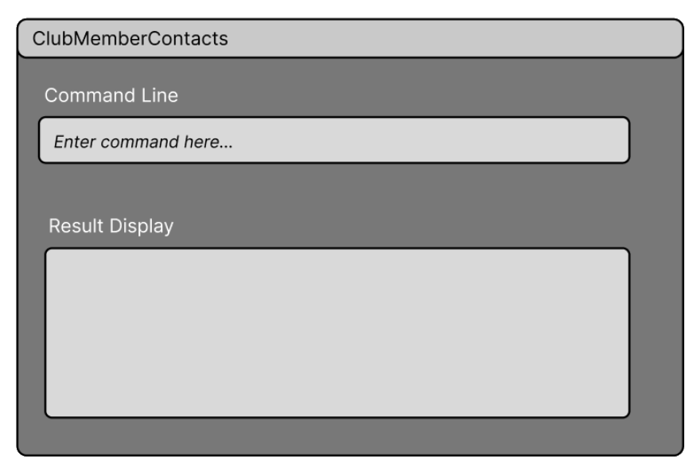

# ClubMemberContacts

ClubMembersContacts is an app to help EXCO members of School of Computing's CCAs to manage the contacts of all their members and applicants in a fast and convenient yet powerful way through a CLI or text-based interface for greater speed.
  * It is **written in OOP fashion**. It provides a **reasonably well-written** code base **bigger** (around 6 KLoC) than what students usually write in beginner-level SE modules, without being overwhelmingly big.
  * It comes with a **reasonable level of user and developer documentation**.

This project is based on the AddressBook-Level3 project created by the [SE-EDU initiative](https://se-education.org).

* Table of Contents
{:toc}	

--------------------------------------------------------------------------------------------------------------------
## Quick start

1. Ensure you have Java 11 or above installed in your Computer.

2. Download the latest clubmemberscontact.jar from [here](https://github.com/se-edu/addressbook-level3/releases).

3. Copy the file to the folder you want to use as the _home folder_ for your AddressBook.

4. Open a command terminal, cd into the folder you put the jar file in, and use the java -jar addressbook.jar command to run the application.<br>
   A GUI similar to the below should appear in a few seconds. Note how the app contains some sample data.<br>
   

5. Type the command in the command box and press Enter to execute it. 
   Some example commands you can try:

   * viewMembers : view all members in the members list.
  
   * viewApplicants : view all applicants in the applicants list.

   * addMember /name Alicia /number 92345678 : The member will be added with the specified name and phone number

   * deleteMember 3 : The specified member at the index will be deleted from the member list. (index starts at 1)


6. Refer to the [Features](#features) below for details of each command.

--------------------------------------------------------------------------------------------------------------------

## Features

## Add Member

### Usage: 

`addMember /name {memberName} /number {phoneNumber} /email {email} /tele {telegramHandle}`

### Acceptable values for parameters:
- memberName: Only alphabetical characters, @, () are allowed
- phoneNumber: Only 8 digits allowed, must start with 6, 8, or 9
- email: Must follow the format of xyz@abc.wsd
- telegramHandle: Only alphanumeric characters, and underscore, are allowed

### Example of usage:

`addMember /name Alicia /number 92345678`

### Expected Outcome:
```
The member will be added with specified details: name and phone number
```

### If member added successfully (Success)

```
Got it! This member has been added: Alicia (Phone number: 92345678)
```

### If name or number parameter is not specified (Failure):

```
Incorrect Usage! Usage: addMember /name {memberName} /number {phoneNumber}
```

### If name contains invalid characters (Failure):

```
Name can only contain alphabetical characters and: @, (, )
```

### If phone number is invalid (Failure):

```
Phone number should be 8 numbers, and must start with 6, 8, or 9
```

### If telegram handle is invalid (Failure):

```
Telegram handles can only contain alphanumeric characters and underscore!
```

## Delete Member

### Usage: 

`deleteMember {index}`

### Expected Outcome:
```
The specified member at the index will be deleted from the member list.(index starts at 1)
```

### If member is found (Success):

```
Got it! This member has been removed: {memberName}
```

### If index is out of range (Failure):

```
Invalid index! Use viewMembers to see all members and their indices.
```

### If there are 0 members (Failure):

```
There are no members to be deleted.
```

### Acceptable values for parameters:
- index: Index of member to be deleted (starting from 1).

## View Members

### Usage:

`viewMembers`

### Expected Outcome:
Generates a list of all existing members in the members list.

### If there is at least 1 member (Success):

```
Got it! These are the current members in the CCA.
	1. Alicia
	2. Rui Jia
	3. Jonas
	4. Win Sheng
	5. Alfred
```

### If there are 0 members (Failure):
```
There are no members in the CCA!
```

## Add Applicant

### Expected Outcome:
The specified applicant will be added to the applicant list.

### Usage: 

`addApplicant /name {applicantName} /email {email}`

### Acceptable values for parameters:
applicantName: Only alphabetical characters, @, () are allowed
email: Must follow the format of xyz@abc.wsd

### Example of usage:

`addApplicant /name Alicia /email abc@gmail.com`

### Expected Outcome:
The applicant will be added with specified details: name and email.

### If member added successfully (Success):

```
Got it! This applicant has been added: Alicia (Email : abc@gmail.com)
```

### If name or email parameter is not specified (Failure):

```
Incorrect Usage! Usage: addApplicant /name {applicantName} /email {email}
```

### If name contains invalid characters (Failure):

```
Name can only contain alphabetical characters and: @, (, )
```

### If email has invalid format (Failure):
```
Email must be in the format of abc@def.ghi
```

## Delete Applicant

### Usage: 

`deleteApplicant {index}`

### Expected Outcome:
The specified member at the index will be deleted from the member list. (Index starts at 1)


### If applicant is found (Success):
```
	Got it! This applicant has been removed: {applicantName}
```

### If index is out of range (Failure):
```
Invalid index! Use viewApplicants to see all members and their indices.
```

### If 0 members in member list (Failure)

```
There are no applicants to be deleted.
```

### Acceptable values for parameters:
- index: Index of applicant to be deleted (starting from 1).


## View Applicants

### Usage:

`viewApplicants`

### Expected Outcome:
Generates a list of all existing members in the applicant list.

### If there is at least 1 applicant (Success):
```
Got it! These are the applicants for the CCA.
	1. Alicia
	2. Rui Jia
	3. Jonas
	4. Win Sheng
	5. Alfred
```

### If there are 0 applicants (Failure):
```
	There are no applicants for the CCA :--(
```

--------------------------------------------------------------------------------------------------------------------

## Command summary

| Action              | Format, Examples                                                                                                                                                                                 |
| ------------------- | ------------------------------------------------------------------------------------------------------------------------------------------------------------------------------------------------ |
| **View Members**    | `viewMembers`                                                                                                                                                                                    |
| **view Applicants** | `viewApplicants`                                                                                                                                                                                 |
| **Add Member**      | `addMember /name {memberName} /number {phoneNumber} /email {email} /tele {telegramHandle}`   e.g., `addMember /name Alicia /number 92345678`                                                     |
| **Add Applicant**   | `addApplicant /name {applicantName} /email {email}` e.g,  `addApplicant /name Alicia /email abc@gmail.com`                                                                                       |
| **Delete Member**   | `deleteMember INDEX` e.g., `deleteMember 3`                                                                                                                                                      |
| **Delete Applicant**| `deleteApplicant INDEX`  e.g., `deleteApplicant 3`                                                                                                                                               |

